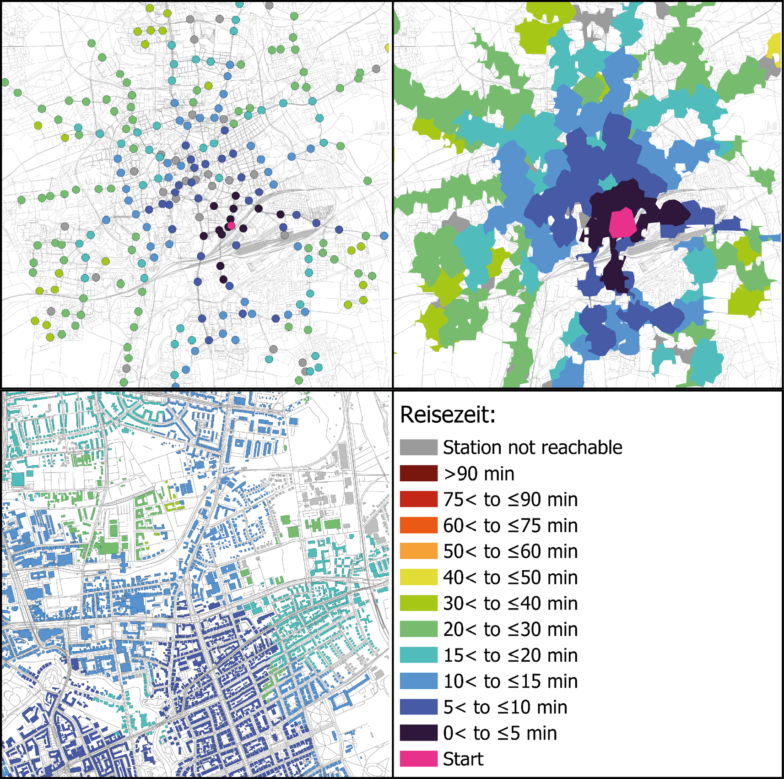

# Anleitung

Mit dem Plugin *Transit Reachability Analyser* können Erreichbarkeiten des ÖPNV berechnet und dargestellt werden. Von einem Startpunkt aus wird zu jeder Station des ÖPNV-Netzes mithilfe von OTP die schnellste Verbindung berechnet. Als Ergebnis wird ein Datensatz erstellt, indem jede Station einen Punkt auf der Karte repräsentiert. In QGIS wird ein Datensatz, bestehend aus Punkten, Punktlayer genannt. Zu jeder Station werden verschiedene Informationen bereitgestellt. Dazu gehören die Reiseaufwandsindikatoren Reisezeit, Reisezeitverhältnis, Gehzeit und Gehdistanz zur ersten Haltestelle sowie die Umsteigehäufigkeit. Zusätzlich wird angegeben, welche ÖPNV-Verbindungen zu der Station ermittelt wurden und welche daraus ausgewählt wurde. Informationen werden in QGIS als Attribute bezeichnet und lassen sich über die Attributtabelle des Punktlayers anzeigen.

Für jeden Indikator kann eine Heatmap erstellt werden, indem die Punkte auf der Karte eingefärbt werden. Neben Punkten können auch Flächen eingefärbt werden. Das können zum Beispiel Isochronen oder Gebäude sein. Eine Isochrone beinhaltet alle Punkte, die von einem Startpunkt aus innerhalb einer vorgegebenen Zeitspanne erreichbar sind.

> **Hinweis:** Das Plugin *Transit Reachability Analyser* ist im Rahmen einer Bachelorarbeit entstanden. Die Ergebnisse wurden nur in Stichproben auf Plausibilität geprüft. Eine ausführliche Untersuchung der Ergebnisse wurde nicht durchgeführt. Auffällige Daten sollten mit zusätzlichen Quellen verglichen werden.

Beispiel Heatmap des Indikators Reisezeit für Punkt- und Polygonlayer, eigene Darstellung, Kartendaten von [OpenStreetMap](https://www.openstreetmap.org):



Auszug aus der Attributtabelle: Strecke Hauptbahnhof - Dedekindstraße:

| **name**                                    | Braunschweig, Dedekindstraße                                                                                                                                                                                                                     |
|---------------------------------------------|------------------------------------------------------------------------------------------------------------------------------------------------------------------------------------------------------------------------------------------------------|
| **travel time [min]**                      | 19                                                                                                                                                                                                                                                  |
| **travel time ratio**                       | 1.2                                                                                                                                                                                                                                                 |
| **itinerary frequency [min]**               | 30                                                                                                                                                                                                                                                  |
| **walk time [min]**                         | 1.2                                                                                                                                                                                                                                                 |
| **walk distance [m]**                       | 104.1                                                                                                                                                                                                                                               |
| **number of transfers**                     | 0                                                                                                                                                                                                                                                   |
| **travel time car [min]**                   | 15.6                                                                                                                                                                                                                                                |
| **max distance station to stop [m]**       | 44.5                                                                                                                                                                                                                                                |
| **selected itinerary**                      | ['WALK', '411', 'WALK'], duration: 19, frequency: 30.0, meters_to_first_stop: 104.1, walktime_to_first_stop: 1.2, firstStop: Braunschweig Hauptbahnhof, lastStop: Braunschweig, Dedekindstraße;                                           |
| **possible itineraries**                    | ['WALK', '4', 'WALK', '421', 'WALK'], duration: 35, frequency: 15.0, meters_to_first_stop: 157.0, walktime_to_first_stop: 1.9, firstStop: Braunschweig, Hauptbahnhof/Viewegs Garten, lastStop: Braunschweig, Dedekindstraße;<br> ['WALK', '411', '421', 'WALK'], duration: 23, frequency: 15.0, meters_to_first_stop: 104.1, walktime_to_first_stop: 1.2, firstStop: Braunschweig Hauptbahnhof, lastStop: Braunschweig, Dedekindstraße; |

# Kurzanleitung

1. GTFS-Feed vorbereiten ([Details](#GTFS-Feed-vorbereiten))
   1.  GTFS-Feed herunterladen. Zum Beispiel von [DELFI e.V.](https://www.opendata-oepnv.de/ht/de/organisation/delfi/startseite?tx_vrrkit_view%5Baction%5D=details&tx_vrrkit_view%5Bcontroller%5D=View&tx_vrrkit_view%5Bdataset_formats%5D%5B0%5D=ZIP&tx_vrrkit_view%5Bdataset_name%5D=deutschlandweite-sollfahrplandaten-gtfs&cHash=01414d5793fcd0abb0f3a2e35176752c) oder [Connect](https://connect-fahrplanauskunft.de/datenbereitstellung/) ([Details](#GTFS-Feed-herunterladen)).
   2. GTFS-Feed filtern mithilfe von [gtfstools](https://ipeagit.github.io/gtfstools/) ([Details](#GTFS-Feed-filtern)).

2. Eine .osm.pbf-Datei bei [Protomaps](https://app.protomaps.com/) herunterladen, die dem Gebiet des GTFS-Feeds entspricht ([Details](#.osm.pbf-Datei-herunterladen)).

3. [OpenTripPlanner 2.5](https://docs.opentripplanner.org/en/latest/Basic-Tutorial/) über das Terminal starten ([Details](#OTP-starten)).

4. *Transit Reachability Analyser* installieren und öffnen.
   1. Erreichbarkeitsanalyse ([Details](#Erreichbarkeitsanalyse))
      1. Koordinaten des Startpunktes angeben.
      2. Untersuchungstag und -zeitraum festlegen.
      3. Gehgeschwindigkeit und maximale Gehzeit wählen.
      4. Speicherort für den Punktlayer festlegen.
      5. Berechnung durch Button *Reachability Analysis* starten.
   2. Optional: Isochronenlayer oder Gebäudelayer mit Attributwerten erstellen ([Details](#Isochronenlayer-symbolisieren)).
   3. Symbolisierung der Daten ([Details](#Isochronenlayer-symbolisieren))
      1. Hierfür wird der OTP-Server nicht benötigt.
      2. Layer wählen (Punkt- oder Polygonlayer möglich).
      3. Darzustellenden Indikator festlegen.

# Ausführliche Anleitung

In *Transit Reachability Analyser* soll die Erreichbarkeit von Haltestellen berechnet werden. Zur Vereinfachung werden Haltestellen mit gleichem Namen zu einem Ziel zusammengefasst. Ein Ziel, das mehrere Haltestellen zusammenfasst, wird in dieser Arbeit Station genannt. Als Name der Station wird der gemeinsame Name der Haltestellen genutzt. In der Regel fasst eine Station zwei Haltestellen zusammen. Es gibt aber auch größere Stationen, die mehr als zwei Haltestellen mit gleichem Namen vereinen.

## GTFS-Feed vorbereiten

GTFS-Feeds ermöglichen es, OpenTripPlanner (OTP) ÖPNV-Verbindungen zu berechnen. Sie enthalten unter anderem Informationen über das Linienangebot und die Fahrzeiten.

### GTFS-Feed herunterladen

Es gibt verschiedene Anbieter, über die GTFS-Feeds heruntergeladen werden können. Für dieses Plugin werden GTFS-Schedule-Feeds benötigt. Manche Verkehrsunternehmen bieten für ihr Gebiet direkt einen GTFS-Feed an. Häufig gibt es aber GTFS-Feeds, die eine größere Region abdecken und dadurch das Angebot verschiedener Verkehrsunternehmen enthalten. Für Niedersachsen stellt zum Beispiel das Unternehmen [Connect](https://connect-fahrplanauskunft.de/) einen GTFS-Feed zur Verfügung. Der GTFS-Feed von DELFI e.V. deckt ganz Deutschland ab und lässt sich über das Portal [Open Data ÖPNV](https://www.opendata-oepnv.de/ht/de/willkommen) herunterladen. Über den Reiter *Archiv* sind auch alte GTFS-Feeds verfügbar.

### GTFS-Feed filtern

*Transit Reachability Analyser* versucht, vom Startpunkt aus zu jeder Station eine Verbindung zu berechnen. Je mehr Stops in dem GTFS-Feed vorhanden sind, desto länger dauert die Berechnung. **Deswegen ist es empfehlenswert, einen GTFS-Feed zu nutzen, der nur das Untersuchungsgebiet abdeckt.** Ist das bereits der Fall, kann dieser Abschnitt übersprungen werden. Ansonsten wird Folgendes benötigt:

- GTFS-Feed
- R
- RStudio (optional)
- [gtfstools](https://ipeagit.github.io/gtfstools/)

Das Ziel ist es, alle Daten eines Verkehrsunternehmens aus einem größeren GTFS-Feed zu filtern. In der Datei `agency.txt` des GTFS-Feeds sind alle Verkehrsunternehmen aufgelistet, deren Verkehrsinformationen in dem GTFS-Feed abgebildet sind. Am Ende sollen in jeder Datei des GTFS-Feeds nur noch Informationen stehen, die zu dem einen Verkehrsunternehmen gehören. Um das zu bewerkstelligen, wird gtfstools benutzt. gtfstools ist ein Package der Programmiersprache R, mit dem GTFS-Feeds unter anderem mithilfe der `agency_id` gefiltert werden können. Die IDE RStudio bietet eine Umgebung, in der mit R gearbeitet werden kann.

Nachdem R und RStudio installiert wurden, wird mit dem folgendem Befehl gtfstools installiert:

```r
install.packages("gtfstools") 
```

Danach können die Zeilen in dem folgenden Code-Block Schritt für Schritt ausgeführt werden. Dabei bitte folgendes beachten:

- Die `agency_id` des verwendeten Verkehrsunternehmens lässt sich in dem GTFS-Feed in der Datei `agency.txt` finden.
- Der Dateipfad muss angepasst werden. Dabei ist es wichtig, auf die .zip-Datei zu verweisen. Für Windows müssen das `r` und die Klammern beibehalten werden.
- Der neue Dateiname muss *gtfs* enthalten, sonst kann OTP die Datei nicht finden.

```r
library(gtfstools)
path <- r"(C:\Benutzer\Benutzername\Dokumente\GTFS_Feed_Name.zip)"
gtfs <- read_gtfs(path)
smaller_gtfs <- filter_by_agency_id(gtfs, "12021") # Hier die agency_id ersetzen.
filename <- r"(C:\Benutzer\Benutzername\Dokumente\Name_gefilterter_GTFS_Feed.zip)"
write_gtfs(smaller_gtfs, filename)
```

## .osm.pbf-Datei herunterladen

Neben einem GTFS-Feed für das ÖPNV-Angebot benötigt OTP auch Informationen über das zugehörige Wegenetz. Damit können zum Beispiel Fußwege zu Haltestellen berechnet werden. Dafür nutzt OTP das Format pbf, welches die Informationen eines Ausschnitts der OSM-Karte in einer Datei speichert.

Es gibt verschiedene Wege, an eine .osm.pbf-Datei zu kommen. Für die nächsten Schritte werden folgende Tools benutzt:

- Entpackter GTFS-Feed
- QGIS
- Plugin QuickMapServices
- Website Protomaps

Wichtig ist an dieser Stelle, dass die Karte in der osm.pbf-Datei mindestens das Gebiet des GTFS-Feeds abdeckt. Um das sicherzustellen, sind folgende Schritte nötig:

1. In QGIS die *Datenquellenverwaltung* öffnen (Strg+L).
2. Den Abschnitt *Getrennte Texte* öffnen.
3. Ganz oben unter *Dateiname* die stops.txt-Datei des verkleinerten GTFS-Feeds öffnen.
4. Auf *Hinzufügen* klicken.
5. Über das Plugin QuickMapServices die OSM-Karte als Hintergrund hinzufügen.
6. Die Website [Protomaps](https://app.protomaps.com/) öffnen.
7. Mit Protomaps lässt sich ein individueller Kartenausschnitt erstellen. Den Ausschnitt in Protomaps mit der Lage der Stops in QGIS abgleichen, damit der Ausschnitt alle Stops beinhaltet.
8. Über *Create Extract* die .osm.pbf-Datei erstellen lassen und herunterladen.


## OTP starten

[OpenTripPlanner](https://docs.opentripplanner.org/en/latest/Basic-Tutorial/) ist ein multimodaler Routenplaner. Das Plugin verwendet diesen als Backend für die Berechnung der ÖPNV-Routen. OTP berechnet auf Basis des GTFS-Feeds und der .osm.pbf-Datei einen Graphen, der das Verkehrsnetz repräsentiert. OTP stellt einen Server zur Verfügung, mit dem über einen Webbrowser interagiert werden kann. Bevor eine Berechnung mit *Transit Reachability Analyser* gestartet werden kann, muss dieser Server gestartet sein. Um OTP zu starten, wird Folgendes benötigt:

- Java Runtime (JRE) oder Java Development Kit (JDK) mindestens in der Version Java 21 oder neuer.
- OpenTripPlanner mindestens in der Version OTP 2.5.0 oder neuer. Dafür auf der verlinkten Seite die gewünschte Version auswählen und die Datei mit der Endung `shaded.jar` [herunterladen](https://repo1.maven.org/maven2/org/opentripplanner/otp/).

Mit den folgenden Schritten lässt sich OTP starten, sodass ein lokaler Server bereitsteht:

1. Die OTP-Datei, den GTFS-Feed und die .osm.pbf-Datei in einen gemeinsamen Ordner legen, der keine weiteren Dateien enthält (z.B. `OTP_Stadt`).
2. Sicherstellen, dass in dem Namen des GTFS-Feeds *gtfs* vorkommt.
3. Terminal öffnen.
4. Mit dem folgenden Befehl erstellt OTP einen Graphen:
   ```bash
   java -Xmx2G -jar C:\Benutzer\Benutzername\Dokumente\ac{otp}_Stadt\
   otp-2.5.0-shaded.jar --build --serve C:\Benutzer\Benutzername\Dokumente\ac{otp}_Stadt
   ```
5. Warten, bis im Terminal *Grizzly server running* steht. Je nach Dateigröße kann dies mehrere Minuten dauern.

Hinweise:

- Der Dateipfad ist ein Beispiel für Windows.
- Enthält ein Ordner in dem Dateipfad ein Leerzeichen im Namen, kann es passieren, dass das Terminal Probleme macht.
- `-Xmx` legt fest, wie viel Speicher OTP maximal nutzen darf. Da GTFS-Feeds und .osm.pbf-Dateien relativ groß sind, braucht OTP relativ viel Speicher.
- Klappt das Starten des Servers nicht, kann es mit mehr Speicher als 2 GB erneut versucht werden. Dabei sollten die Grenzen des Computers im Blick behalten werden.
- Statt `--build` und `--serve` gibt es noch weitere Ausführungsmöglichkeiten. Ein Graph lässt sich zum Beispiel speichern und erneut darauf zurückgreifen. Dadurch wird bei regelmäßigem Nutzen des gleichen Graphen Zeit gespart. Details dazu sind in der [Dokumentation von OTP](https://docs.opentripplanner.org/en/latest/Basic-Tutorial/) zu finden.

## Transit Reachability Analyser nutzen

In den folgenden Abschnitten wird die Installation und Nutzung des Plugins erläutert. Zusätzlich werden die Schritte aufgezeigt, die nötig sind, um Isochronen oder Gebäude mithilfe von *Transit Reachability Analyser* einzufärben.

### Installation

Damit *Transit Reachability Analyser* funktioniert, müssen die folgenden Python-Packages in QGIS installiert sein:

- requests
- json
- geopandas
- pandas
- geopy

Es ist gut möglich, dass die Packages bereits installiert sind. Ist das nicht der Fall, wird QGIS bei der Installation des Plugins oder beim Starten eine Fehlermeldung einblenden. Dann müssen die Packages manuell über `pip` installiert werden. Wie das in QGIS geht, ist für jedes Betriebssystem verschieden. Folgende Schritte werden für Windows empfohlen:

- OSGeo4W shell öffnen. Das wurde zusammen mit QGIS installiert.
- ```bash
   python -m pip install {package name}
   ```

### Erreichbarkeitsanalyse

Um eine Erreichbarkeitsanalyse durchzuführen, muss für jede fett gedruckte Kategorie ein Wert festgelegt werden.

- Der Startpunkt der Berechnung muss über Koordinaten angegeben werden. Die Koordinaten von einem Punkt können zum Beispiel aus [OpenStreetMap](https://www.openstreetmap.org) kopiert werden. Über einen *Rechtsklick* an den entsprechenden Punkt kann die Option *Adresse anzeigen* gewählt werden. Dadurch werden die Koordinaten in dem *Suchfeld* angezeigt.
- Ein GTFS-Feed gilt nur für eine bestimmte Zeit. Bei der Wahl des Tages sollte das Datum in diesem Zeitraum liegen.
- Bei der Eingabe der Werte ist es vor allem wichtig, auf die Syntax der Eingabe zu achten. Dabei kann sich an den Beispielen in den jeweiligen Feldern orientiert werden.
- Nach Auswahl der Gehgeschwindigkeit und Gehzeit kann die daraus resultierende Distanz in Metern berechnet werden. Dieser Schritt ist optional und dient als Orientierungshilfe.
- Wird OTP nach der obigen Anleitung gestartet, startet der Server auf der Portnummer 8080. Diese Einstellung muss nur geändert werden, wenn beim Starten von OTP eine andere Portnummer angegeben wurde. Ist unklar, ob die Verbindung zu OTP funktioniert, kann dies über den entsprechenden Button ausprobiert werden. Dieser Schritt ist optional.
- Bei der Bestätigung des **Get All Stops**-Buttons wird ein Punktlayer mit allen Haltestellen erzeugt. Die Attributtabelle enthält eine Spalte, in der alle Abfahrtszeiten jeder Linie in dem gewählten Zeitfenster aufgelistet sind.
- Der **Get All Stations**-Button erstellt einen Punktlayer, bei dem je ein Punkt alle Stops mit gleichem Namen zusammenfasst. Es werden noch keine Erreichbarkeiten berechnet, weswegen die Laufzeit kurz ist, die Attributtabelle aber leer bleibt.
- Der **Reachability Analysis**-Button führt die Erreichbarkeitsanalyse durch. OTP berechnet für jede Strecke vom Startpunkt zu den einzelnen Stationen verschiedene Verbindungen. Das Plugin wählt aus den vorgeschlagenen Verbindungen die schnellste aus. Anhand der Werte dieser Verbindung werden die Reiseaufwandsindikatoren gesetzt. Je mehr Stationen in dem Gebiet liegen, desto länger dauern die Berechnungen. Je nach Rechenleistung kann es einige Minuten dauern, bis die Berechnung fertig ist und QGIS wieder nutzbar ist.

### Layer Symbolisierung

Bei der Symbolisierung werden die Spalten in der Attributtabelle genutzt. Deswegen ist es wichtig, dass die Namen der Spalten nicht verändert werden. Die Position kann verändert werden. Es muss immer ein Layer und ein Indikator, der symbolisiert werden soll, ausgewählt werden. Es kann sowohl die Symbolisierung von Punkt- als auch von Polygonlayer verändert werden.

### Isochronenlayer symbolisieren

**Isochronen Berechnen**

- Plugin Valhalla installieren.
- *Werkzeugkiste - Valhalla - Pedestrian - Isochrones Pedestrian* öffnen.
- Als *Provider* sollte FOSSGIS voreingestellt sein.
- Als *Input Point layer* einen Punktlayer auswählen, der mit Transit Reachability Analyser berechnet wurde.
- Als *Input layer ID Field* Name auswählen. Dieser Schritt ist wichtig, weil über den Namen später die restlichen Attribute richtig zugeordnet werden.
- Als *Mode* hat sich *Shortest* bewährt.
- Isochronengröße angeben.
- Berechnung starten.

Prinzipiell können auch andere Plugins verwendet werden. Meistens ist aber ein API-Key nötig, der erst (kostenfrei) erstellt werden muss. Das ist bei FOSSGIS nicht nötig. Außerdem müssen relativ viele Isochronen berechnet werden. Manche Anbieter haben ein Limit an Berechnungen pro Minute gesetzt, weswegen das relativ lange dauern kann.  
Die Größe der Isochronen sollte einer Entfernung entsprechen, die am Ende maximal gelaufen werden soll, zum Beispiel 5 Minuten. Um die Isochronen in Valhalla über eine Kilometerangabe zu definieren, müssen Zeit und Geschwindigkeit in Entfernung umgerechnet werden.  
Bei der Eingabe einen Punkt für Dezimalwerte nutzen. Das Komma trennt verschieden große Isochronen.

**Attribute den Isochronen zuweisen**

- *Werkzeugkiste - Vektoren allgemein - Attribute nach Feldwert verknüpfen* öffnen.
- *Eingabelayer*: Polygonlayer mit den berechneten Isochronen.
- *Tabellenspalte*: Name.
- *Eingabelayer 2*: Punktlayer mit Attributtabelle, die über Transit Reachability Analyser berechnet wurde.
- *Tabellenfeld 2*: Name.
- *Layer 2 zu kopierende Felder*: Hier über die drei Punkte rechts alle Spalten auswählen, die kopiert werden sollen.
- Starte.
- Transit Reachability Analyser starten und Isochronenlayer für die Symbolisierung auswählen.

Hierbei ist es wichtig, dass die Namensspalte in dem Punkt- und Isochronenlayer gleich sind. Das trifft auf jeden Fall auf den Layer zu, über den die Isochronen generiert wurden. Es empfiehlt sich, den Isochronenlayer zu duplizieren und so einen unveränderten Layer zu behalten. Dadurch müssen die Isochronen nicht immer neu berechnet werden.

### Gebäudelayer symbolisieren

**Buildingslayer herunterladen**

- Plugin QuickOSM installieren.
- *Vektor - QuickOSM - QuickOSM* öffnen.
- In *Kartenvolage* *Urban* auswählen. Alternativ in *Schnelle Abfrage* den *Schlüssel* *building* nutzen.
- Für den Downloadbereich im Dropdown Menü *Layer-Ausdehnung* auswählen und einen Punktlayer von Transit Reachability Analyser nutzen.

**Attribute den Gebäuden zuordnen**

- *Werkzeugkiste - Vektoren allgemein - Attribute nach Position verknüpfen* öffnen.
- *Mit Objekten verknüpfen in*: Gebäudelayer.
- *Ort der Objekte*: schneidet auswählen.
- *Durch Vergleich mit*: Isochronenlayer mit Attributen.
- *Hinzufügende Felder*: über den Button mit den drei Punkten alle gewünschten Attribute auswählen.
- Im Dropdown Menü *Separates Objekt für jedes passende Objekt erzeugen (eines-zu-vielen)* auswählen.
- Starte.
- Den neuen Layer in Transit Reachability Analyser auswählen und Symbolisierung verändern.

Wichtig ist, dass das Textfeld zu *Präfix für verknüpfte Felder* leer bleibt. Sonst werden die Spaltennamen verändert und dann funktioniert die Symbolisierung von Transit Reachability Analyser nicht mehr.

## Daten auswerten

Beim Bewerten der Daten ist zu beachten, dass die Ergebnisse nur für den einen Startpunkt gelten. Die Ergebnisse können und sollten nicht auf das Gesamtnetz und Gesamtangebot verallgemeinert werden.  
Bei einer nicht repräsentativen Auswertung der Daten zeigte sich, dass die Verbindungen, die von OTP vorgeschlagen werden, auf wenig Umstiege und nicht auf die kürzeste Reisezeit optimiert sind.  
Die Angaben in der Attributtabelle zu Fußstrecken beziehen sich nur auf den Weg zur ersten Haltestelle. Die restlichen Fußwege, zum Beispiel bei einem Umstieg oder zwischen letzter Haltestelle und Ziel, werden nicht direkt betrachtet. Sie fließen nur in die Reisezeit mit ein.  
Manche Berechnungen der Weglänge von der letzten Haltestelle zur zugehörigen Station sind unrealistisch lang. Das verlängert die Reisezeit.  
Der Takt wird nur über die ersten Abfahrten einer Verbindung berechnet. Deswegen ist ein Taktwechsel innerhalb eines Suchfensters nicht sichtbar. Sollte der Fokus der Analyse auf dem Takt liegen, sollte darauf geachtet werden, dass der Takt am Anfang des Zeitfensters repräsentativ für den analysierten Zeitraum ist.  
Aufgrund von unerwarteten Rückgaben von OTP ist die Taktberechnung nicht immer richtig. An manchen Stellen kann der berechnete Takt besser sein, als der tatsächliche Takt. Wirken Werte unrealistisch, sollten diese nachgeprüft werden.

## Mögliche Problemlösungen

In den folgenden Abschnitten wird auf Probleme eingegangen, die bei der Nutzung von *Transit Reachability Analyser* auftreten können. Treten weitere Probleme auf, kann sich an Foren für QGIS oder OTP gewandt werden. Alternativ kann auch ein [Pull request](https://github.com/ThanDerJoren/transitReachabilityAnalyser/pulls) für *Transit Reachability Analyser* geschrieben werden.

### OTP lässt sich nicht starten

Im Terminal führen Leerzeichen in einem Dateipfad zu Fehlern. In dem gesamten Dateipfad, der beim Starten von OTP angegeben wird, darf kein Leerzeichen vorkommen. Lässt sich das nicht vermeiden, muss bei Windows der Dateipfad in Anführungszeichen angegeben werden.

### OTP bricht beim Starten des Servers ab

`gtfstools` filtert nicht immer den GTFS-Feed von DELFI e.V. richtig. Dann kann es sein, dass OTP den Server nicht gestartet bekommt. In diesem Fall muss die erste Zeile im Terminal gesucht werden, in der ERROR steht. Ein Fehler sieht zum Beispiel folgendermaßen aus:
```
ERROR [main]  (OTPMain.java:60) An uncaught error occurred inside OTP: io error:
entityType=org.onebusaway.gtfs.model.Transfer path=transfers.txt lineNumber=2459
```

Informativ ist an dieser Stelle das Ende. Hier steht die Datei (transfers.txt) in der der Fehler auftrat und die Zeile (2459) in dieser Datei. In dieser Zeile gab es einen Umstieg in eine Linie eines anderen Verkehrsunternehmens, das in der gefilterten Datei nicht vorhanden war. Durch manuelles Löschen dieser Zeile ließ sich das Problem beheben.  
Alternativ gibt es noch das Tool [gtfstidy](https://github.com/patrickbr/gtfstidy), mit dem sich wohl GTFS-Feeds verbessern lassen.

### Probleme mit Transit Reachability Analyser

Lässt sich das Plugin nicht ausführen, hilft es, in das Protokoll von QGIS zu schauen. Dort wird in der *WARNING* der Fehler spezifiziert, weswegen das Plugin nicht ausführbar ist. In der *INFO* darüber wird angezeigt, was geändert werden muss, um den Fehler zu vermeiden.  
Wird trotz korrekter Ausführung nichts berechnet, kann das an dem Tag der Berechnung liegen. Ein GTFS-Feed gilt nur für eine bestimmte Zeitspanne. Ist der Berechnungstag außerhalb dieser Spanne, wird nichts berechnet, es kommt aber auch kein Fehler. Zum Ausschließen dieses Fehlers sollte am besten als Berechnungstag der Tag gewählt werden, an dem der GTFS-Feed heruntergeladen wurde.

### Layer ist auf der Karte nicht zu finden

Ist ein Layer auf der Karte nicht zu finden, sollte als Erstes kontrolliert werden, ob der Layer sichtbar geschaltet ist. Ist das der Fall, lässt sich nach Rechtsklick auf den Layer die Option *Auf Layer zoomen* auswählen. So lässt sich herausfinden, wo der Layer angezeigt wird. Eine Darstellung am falschen Ort kann an der Wahl des Koordinatenbezugssystems (KBS) liegen.

### Verzerrte Darstellung der Layer

*Transit Reachability Analyser* exportiert die Punktlayer mit dem Koordinatenbezugssystem (KBS) EPSG:4326 WGS84. Sonst würden die Punkte an einem falschen Ort angezeigt werden. Die OSM-Hintergrundkarte hat dagegen das KBS EPSG:3857 WGS84/Pseudo-Mercator. Damit diese Karte verzerrungsfrei dargestellt wird, muss das KBS des gesamten Projektes auf EPSG:3857 gestellt werden. Das lässt sich ganz unten rechts in QGIS einstellen.


[//]: # (# Anleitung)

[//]: # ()
[//]: # (Mit dem Plugin Transit Reachability Analyser können Erreichbarkeiten des ÖPNV berechnet und dargestellt werden. Es wird von einem Startpunkt zu jeder Station des ÖPNV-Netzes mithilfe von OpenTripPlanner die schnellste Verbindung berechnet. Als Ergebnis wird ein Punktlayer mit einer Attributtabelle erstellt, der zu jeder Station verschiedene Informationen bereitstellt. Dazu gehören die Reiseaufwandsindikatoren Reisezeit, Reisezeitverhältnis, Gehzeit und Gehdistanz zur ersten Haltestelle sowie die Umsteigehäufigkeit. Zusätzlich sind in der Attributtabelle die gewählte Verbindung und weitere mögliche Verbindungen sichtbar.  )

[//]: # (Für jeden Reiseaufwandsindikator stellt das Plugin ein Farbschema bereit, in dem sich der Punktlayer einfärben lässt. Wird auf Basis des Punklayers ein Polygonlayer erzeugt, lässt sich auch dieser von dem Plugin in den verschiedenen Farbschemata einfärben.)

[//]: # ()
[//]: # (## Hinweis)

[//]: # ()
[//]: # (Das Plugin Transit Reachability Analyser ist im Rahmen einer Bachelorarbeit entstanden. Das sollte beim Nutzen der berechneten Daten berücksichtigt werden. Die Berechnungen wurden nicht systematisch auf Plausibilität geprüft. Merkwürdige Daten sollten mit einer weiteren Quelle verglichen werden.)

[//]: # ()
[//]: # (## Kurzanleitung)

[//]: # ()
[//]: # (- GTFS Feed herunterladen. Zum Beispiel von [DELFI e.V.]&#40;https://www.opendata-oepnv.de/ht/de/organisation/delfi/startseite?tx_vrrkit_view%5Baction%5D=details&tx_vrrkit_view%5Bcontroller%5D=View&tx_vrrkit_view%5Bdataset_formats%5D%5B0%5D=ZIP&tx_vrrkit_view%5Bdataset_name%5D=deutschlandweite-sollfahrplandaten-gtfs&cHash=01414d5793fcd0abb0f3a2e35176752c&#41; oder [Connect]&#40;https://connect-fahrplanauskunft.de/&#41;.)

[//]: # (- GTFS Feed vorbereiten mithilfe von [gtfstools]&#40;https://ipeagit.github.io/gtfstools/&#41;.  )

[//]: # (- `.osm.pbf` Datei in der Ausdehnung des GTFS Feeds bei [Protomaps]&#40;https://app.protomaps.com/&#41; herunterladen.)

[//]: # (- [OpenTripPlanner]&#40;https://docs.opentripplanner.org/en/latest/Basic-Tutorial/&#41; im Terminal ausführen.)

[//]: # (- Transit Reachability Analyser öffnen.)

[//]: # (    - Erreichbarkeitsanalyse)

[//]: # (        - Koordinaten des Startpunkts angeben.)

[//]: # (        - Untersuchungstag und -zeitraum festlegen.)

[//]: # (        - Gehgeschwindigkeit und maximale Gehzeit wählen.)

[//]: # (        - Speicherort für den Punktlayer festlegen.)

[//]: # (        - Berechnung durch Button „Reachability Analysis“ starten.)

[//]: # (    - Optional: Isochronenlayer oder Buildingslayer mit Attributwerten erstellen.)

[//]: # (    - Symbolisierung der Daten)

[//]: # (        - Hierfür wird der OTP Server nicht benötigt.)

[//]: # (        - Layer wählen &#40;Punkt- oder Polygonlayer möglich&#41;.)

[//]: # (        - Darzustellenden Indikator festlegen.)

